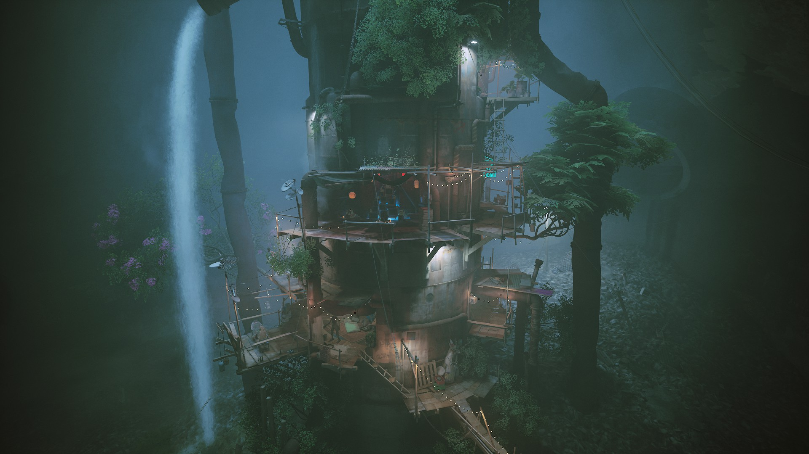
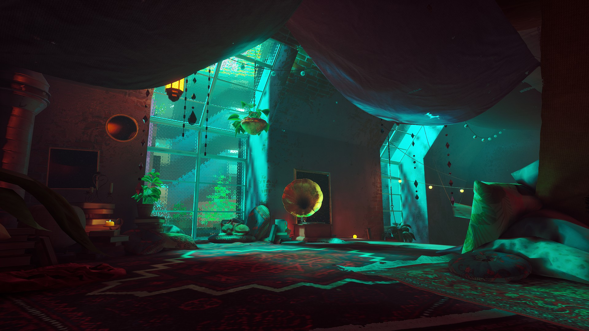
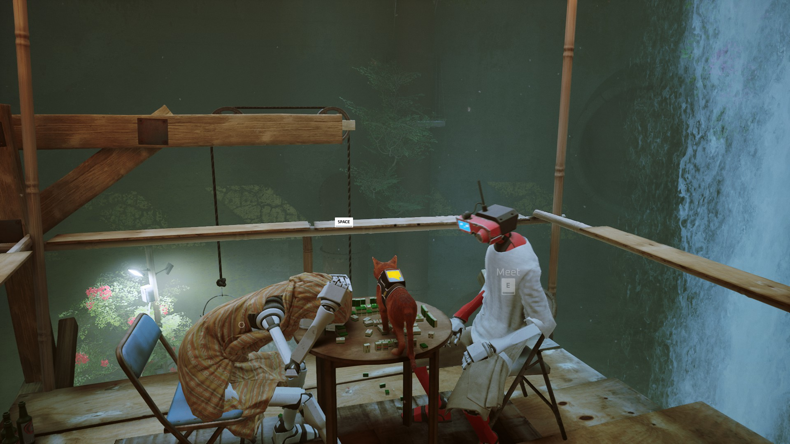
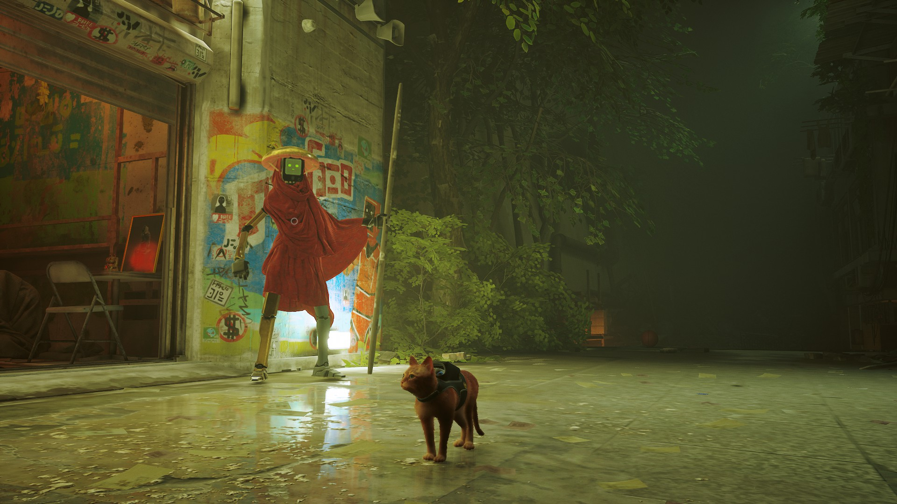
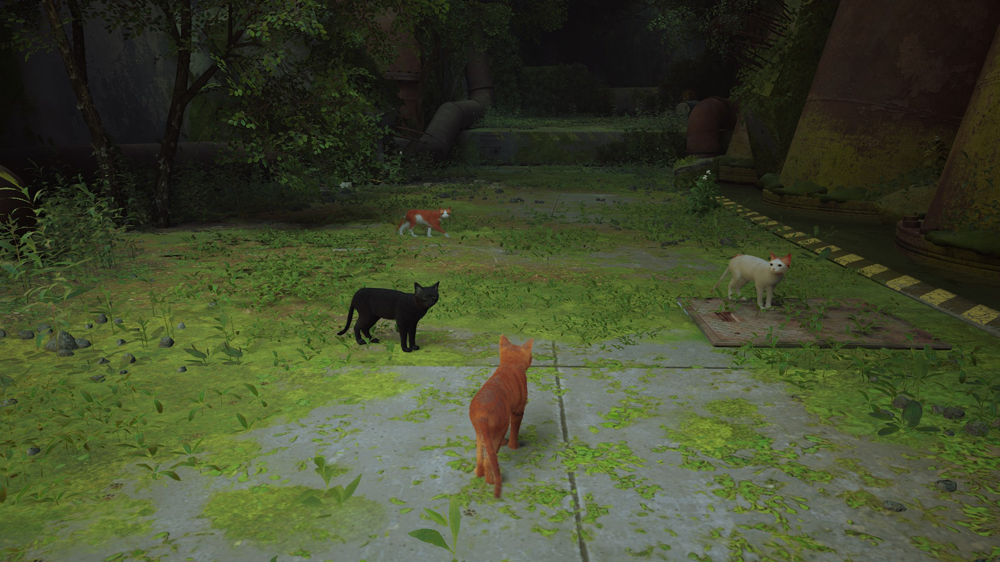
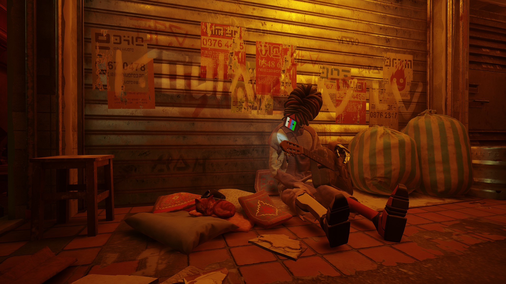
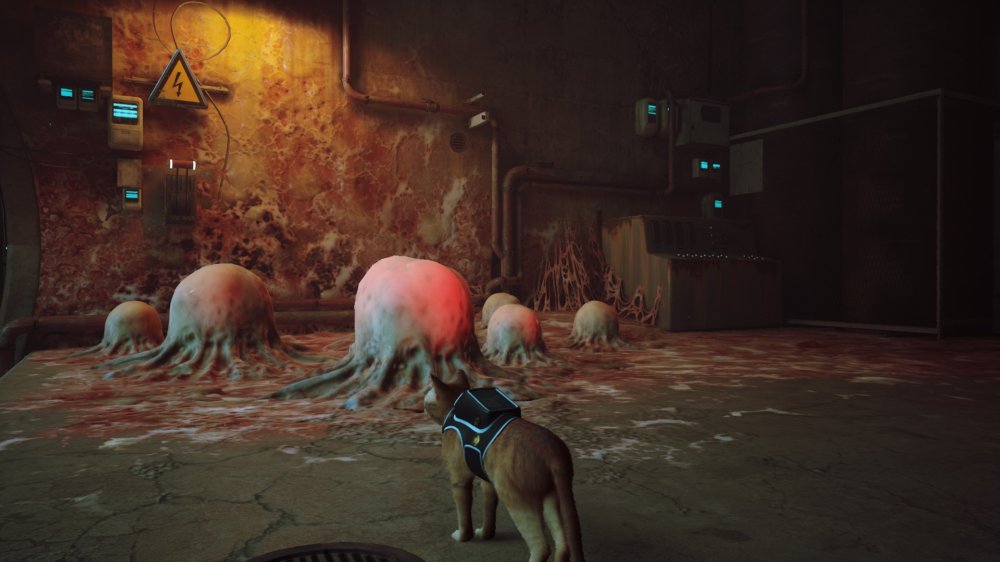
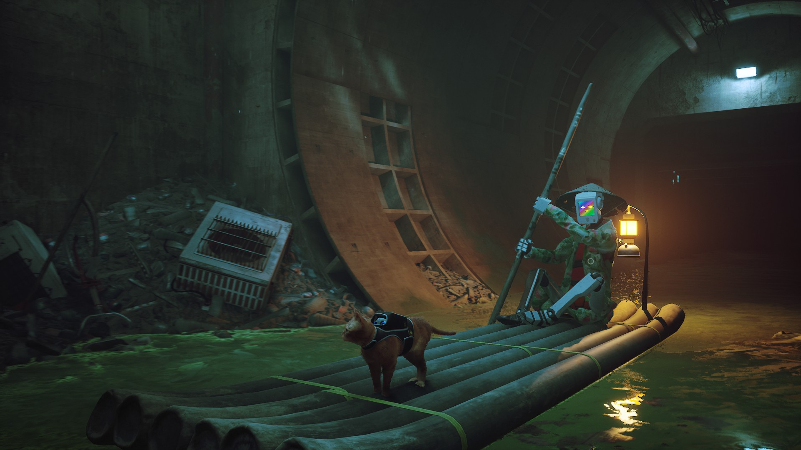
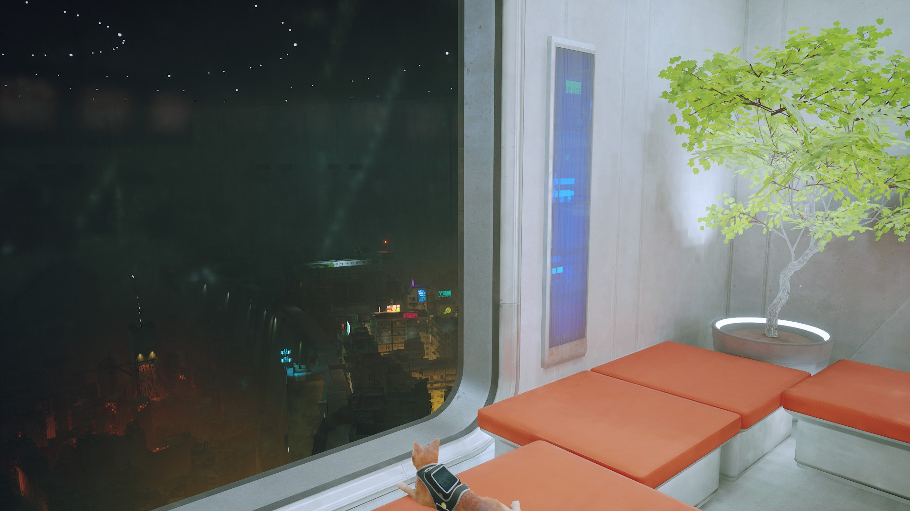

I've been looking forward to this game for several years now. I played every spare hour I had since I got it and it did not disappoint.

Stray could have stood on the novelty of playing as a cat but it also fully delivered as an adventure game. As pressing and exciting as the plot is, the game appropriately encourages you to take your time and enjoy your surroundings as a cat would.

At the same time though, through the characters you meet along the way the game makes you feel and think about what it means to be human and one's purpose in life.

## ⚠️ Spoiler Alert: going forward ⚠️

You start the game off as a "stray" cat wandering an overgrown concrete landscape. Until unfortunate circumstances separate you from your family and land you in a seemingly abandoned underground city.

Along the way you meet B-12 and the Companions, helper robots created by humans in their image. 

Most can only survive in small safe holds. These villages protect them from the Zerk, a bacteria created to eat garbage that evolved out of the human’s control.

In your journey to escape the city you team up with a group of freedom fighters, the Outsiders.

In the end you escape a system of control that… had no control itself.

